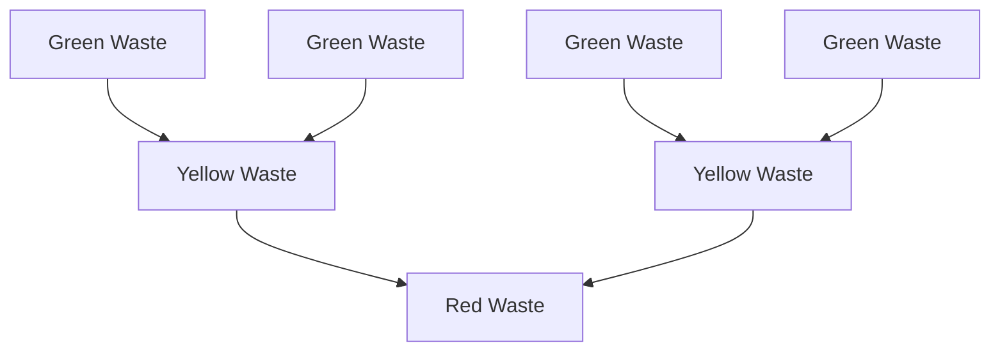

# Multi Agent Systems - Robot Mission

Project related to the Multiple Agents Systems lecture at CentraleSupelec. The purpose of the project is to implement a simple multi-agent system where multiple robots have to collaborate to achieve a common goal: to collect radioactive waste in a grid environment. The robots have to navigate the grid, collect the waste, transform it, then bring it to a specific location.

The project is implemented in Python using the Solara framework with Mesa.

## Setup

### Prerequisites

Make sure you have Python 3.10 or higher installed on your system. Then, you can install the required dependencies using pip:

```bash
pip install -r requirements.txt
```

### Running the model

To run the model, simply execute the following command from the repository ̀`1_robot_mission_MAS2026` directory:

```bash
solara run run.py
```

### Running the model with the comparisons of three different scenari

Three scenari: Random VS   Patrol+Memory and no communication   VS Patrol+Memory+Communication
To run the model, simply execute the following command from the repository ̀`group1_robot_mission_MAS2026` directory:

```bash
solara run run_comparison.py
```

## Model hypothesis

Most of the rules of the model are defined in the [subject file](./Self-organization%20of%20robots%20in%20a%20hostile%20environment%202026.pdf).

Nonetheless, we had to make some assumptions to implement the model. Here are the main ones:

- Two robots can't be on the same cell.
- Robot perception field is limited to the 4 adjacent cells (von Neumann neighborhood).
- Robots can only move in the 4 cardinal directions (no diagonal movement).
- Robots can communicate and do an action in the same step.

## Model design

Each of the three robot types are implemented in separate classes that all implement a common interface `Robot`. Here are the specificities of each robot type:

- **Green robots**: they are the only ones that can collect green waste that are randomly generated in the green area. They cannot exceed the green area. When they have 2 green waste in their inventory, they transform them into a yellow waste.
- **Yellow robots**: they are the only ones that can collect yellow waste produced by the green robots. They cannot go in the red area. When they have 2 yellow waste in their inventory, they transform them into a red waste.
- **Red robots**: they are the only ones that can collect red waste produced by the yellow robots. They can go everywhere but they are the only ones that can bring the waste to the disposal cell.

### 3.3. Waste

Wastes are inert objects that can be mered (for green and yellow waste) or collected by the robots. They are represented as objects that have a type (green, yellow or red) and a position on the grid. Green wastes are initially generated in the green area and can be transformed by the robots as follows:



## 4. Metrics

To measure and objectively compare the performance of the model under different scenarios, we will define several metrics. For synthetic purpose, we denote $\mathcal C = \{green, yellow, red\}$ the set of waste types and robot types.

### 4.1. Completion metrics

$T$: the scenario duration (number of steps to conclude the scenario).

A METTRE À JOUR

$C_f$: the final ratio of collected waste.

$$C_f = \frac{N_{collected}}{N_{collectable}}$$

Where $N_{collected}$ is the total number of waste collected (whatever the color) by the robots. $N_{collectable}$ represents the total number of collectable wastes based on the initial setting according to this formula:
$$N_{collectable} = N_{generated}^{red} + 1.5\cdot N_{generated}^{yellow} + 1.75 \cdot N_{generated}^{green}$$

Where $N_{generated}^{k}$ is the number of waste of type $k$ that were generated at the beginning of the scenario. The coefficients 1.5 and 1.75 are used to take into account that when merged, they will generate a new waste.

> Note: this metrics penalizes more uncollected green wastes.

### 4.2. Speed metrics

$ls_k$ with $k \in \mathcal C$: the average lifespan of wastes. This metric gives us an idea of how quickly the waste is being processed by the robots. A lower average lifespan indicates that the waste is being processed and transformed more efficiently.

$$ls_k = \frac{1}{N_k} \sum_{i=1}^{N_k} (t_{processed}^i - t_{generated}^i)$$

Where $N_k$ is the number of wastes of type $k$ that were processed, $t_{processed}^i$ is the time step at which waste $i$ was processed (collected and transformed or landed on the disposal area), and $t_{generated}^i$ is the time step at which waste $i$ was generated.

$expl_k$ with $k \in \mathcal C$: the exploration ratio. This metric gives us insight into how much time the robots spend exploring the environment versus collecting waste. A higher exploration ratio may indicate that the robots are spending more time searching for waste, while a lower ratio may suggest that they are more efficient at finding and collecting waste.

$$expl_k = \frac{T_{exploration}}{T_k}$$

Where $T_{exploration}$ is the total time spent by robots of type $k$ exploring the environment, and $T_k$ is the duration until which all wastes of type $k$ and below are collected.

### 4.3. Load balancing metrics

$load_k$ with $k \in \mathcal C$: the load balancing ratio. This metric gives us an idea of how well the workload is distributed among the robots.

$$load_k = \frac{1}{N_k} \sum_{i=1}^{N_k} \frac{w_i}{\sum_{j=1}^{N_k} w_j}$$

Where $N_k$ is the number of robots of type $k$ and $w_i$ is the amount of waste collected by robot $i$. A load balancing ratio close to 1 indicates that the workload is evenly distributed among the robots, while a ratio close to 0 indicates that one or a few robots are doing most of the work.

## 5. Model evaluation

### 5.1. Settings

We freeze some of the settings of the model:

- Grid size ($w$ x $h$): 18 x 14
- Number of green wastes: 20
- Max number of steps: 400

Based on the problem, we will consider that each robot has a given cost per step. This is justified because the higher the radioactivity of the area, the more the robot will be expensive to maintain and operate. We will consider the following costs for each type of robot:

- Green robots: 1 unit of cost per step
- Yellow robots: 2 units of cost per step
- Red robots: 3 units of cost per step

### 5.2. Scenarios

#### 5.2.1. Main scenarios

We will consider 3 main scenarios with different robots behaviors:

- **Scenario 1 ($S^{rand}$)**: Random behavior: robots move randomly in the environment and collect waste whenever they find it.
- **Scenario 2 ($S^{k}$)**: Knowledge based behavior: robots have a basic knowledge of the environment and try to move towards the areas where they are more likely to find waste.
- **Scenario 3 ($S^{com}$)**: Communication based behavior: robots communicate with each other to share information about the location of waste and coordinate their movements to optimize the collection process.

#### 5.2.1. Sub-scenarios

In addition, we will further specify scenarios in different sub-scenarios with different numbers of robots of each type to evaluate the impact of the cost on the overall performance of the system:

- **Sub-scenario $n_g, n_y, n_r$ ($S_{n_g, n_y, n_r}$)**: Random behavior with $n_g$ green robots, $n_y$ yellow robots and $n_r$ red robots.

We will study those sub-scenarios: $S_{1, 1, 1}$, $S_{1, 2, 3}$, $S_{3, 2, 1}$, $S_{3, 3, 3}$, $S_{5, 5, 5}$.

### 5.3. Robots behaviors

We will denote $G$, $Y$ and $R$, respectively a green, yellow and red robot. We denote the color of the robot, and the next color if it exists as $c$ and $c'$. For example, for a green robot, $c = green$ and $c' = yellow$.

Between the different behaviors, new capabilities will be writtern in <p style="display:inline;color:green;">green</p> and upgraded capabilities will be writtern in <p style="display:inline;color:orange">orange</p>.

#### 5.3.1. Random behavior

When in **random behavior**, the robots don't have any memory and cannot communicate. Thus, at each deliberation step, here is what they do:

**$G$ and $Y$ robots**:

1. If they carry 2 $c$ wastes, they transform them into a $c'$ waste.
2. Else, if they carry a $c'$ object, they move to the border to drop it.
3. Else, if a $c$ waste is in their cell, they pick it up.
4. Else, move randomly.

**$R$ robots**:

1. If not carrying any waste and a $c$ waste is in their cell, they pick it up.
2. Else, if on the disposal cell and carrying a $c$ waste, they drop it.
3. Else, move randomly.

#### 5.3.2. Knowledge based behavior

When in **knowledge based behavior**, the robots have a basic knowledge of the environment and try to move towards the areas where they are more likely to find waste. They also have a memory, but no communication.

Note that with memory, $Y$ and $R$ robots will have 2 research modes:
- **exploration mode**: exploring randomly their environment by prefering cells that have never been visited before, or that haven't been visited for a long time.
- **patrol mode**: exploring along the western border of the color $c$ area (y-axis) to find waste. This will facilitate the search for wastes that were transformed by robots of the previous color.

At each step, if in exploration mode, their inner timer will be decremented until it reaches 0, then they will switch to patrol mode. If in patrol mode, they will have a random probability to switch to exploration mode.

Thus, at each deliberation step, here is what they do:

**$G$ robots**:

1. If they carry 2 green wastes, they transform them into a yellow waste.
2. Else, if they carry a yellow waste, they move to the border to drop it.
3. Else, if a green waste is in their cell, they pick it up.
4. <p style="display:inline;color:green">Else, if they know a cell with a green waste, they move towards it.</p>
5. Else, they <p style="display:inline;color:orange">explore randomly by prefering cells that have never been visited before, or that haven't been visited for a long time.</p>

**$Y$ robots**:
1. If they carry 2 yellow wastes, they transform them into a red waste.
2. Else, if they carry a red waste, they move to the border to drop it.
3. Else, if a yellow waste is in their cell, they pick it up.
4. <p style="display:inline;color:green">Else, if they know a cell with a yellow waste, they move towards it.</p>
5. <p style="display:inline;color:green">Depending on their research mode</p>

   1. <p style="display:inline;color:orange">If they are in exploration mode, they explore randomly by prefering cells that have never been visited before, or that haven't been visited for a long time.</p>
   2. <p style="display:inline;color:green">If they are in patrol mode, they go to the border, then they explore along the y-axis.</p>

**$R$ robots**

1. If not carrying any waste and a red waste is in their cell, they pick it up.
2. <p style="display:inline;color:green">Else, if they don't know yet where the disposal cell is, they explore the y-axis at the most eastern part of the map to find it.</p>
3. Else, if they are on the disposal cell and carrying a red waste, they drop it.
4. <p style="display:inline;color:green">Else, if they know a cell with a red waste, they move towards it.</p>
5. <p style="display:inline;color:green">Depending on their research mode</p>
   
   1. <p style="display:inline;color:orange">If they are in exploration mode, they explore randomly by prefering cells that have never been visited before, or that haven't been visited for a long time.</p>
   2. <p style="display:inline;color:green">If they are in patrol mode, they go to the border, then they explore along the y-axis.</p>

#### 5.3.3. Communication based behavior

When in **communication based behavior**, the robots have the same capabilities as in knowledge based behavior, but they can also communicate with each other to share information about [TO BE COMPLETED].

## 6. Results

For each scenario and each scenario, we will run 10 simulations and compute the average of the metrics defined in section 4 with respect to the cost of the robots. We will then compare the results of the different scenarios to evaluate the impact of the different behaviors and the cost on the overall performance of the system.
## Metrics

To evaluate the performance of our model, we defined several metrics:

|                    Notation                    | Metric                               | Description                                                                                                                                                                                                                                    |
| :--------------------------------------------: | ------------------------------------ | ---------------------------------------------------------------------------------------------------------------------------------------------------------------------------------------------------------------------------------------------- |
|                     $C_f$                      | Final ratio of collected waste       | The ratio of collected waste to the total amount of waste generated. This metric gives us an idea of how efficient the robots are at collecting waste.                                                                                         |
|                      $T$                       | Scenario duration                    | Number of steps to conclude the scenario.                                                                                                                                                                                                      |
| $n_{k}(t)$ with $k \in \{green, yellow, red\}$ | Number of wastes collected over time | The number of wastes collected at each time step. This metric allows us to see how the collection process evolves over time and if there are any bottlenecks or periods of inactivity.                                                         |
|   $E_k$ with $k \in \{green, yellow, red\}$    | Exploration ratio                    | The ratio of time steps where robots are exploring (moving while searching for a waste) to the total number of time steps. This metric gives us insight into how much time the robots spend exploring the environment versus collecting waste. |
|   $ls_k$ with $k \in \{green, yellow, red\}$   | Average lifespan of wastes           | The average number of time steps that a waste remains in the environment before being fully processed (collected and transformed). This metric helps us understand how quickly the waste is being processed by the robots.      

> Compare the case with rendezvous and without rendezvous 
> If rendezvous = no emergency drop ()
> the current version = rendezvous. The version with emergency drop was deleted

## Authors

- [Alexandre Faure](mailto:alexandre.faure@student-cs.fr): student at CentraleSupelec
- [Sarah Lamik](mailto:sarah.lamik@student-cs.fr): student at CentraleSupelec
- [Ylias Larbi](mailto:ylias.larbi@student-cs.fr): student at CentraleSupelec
