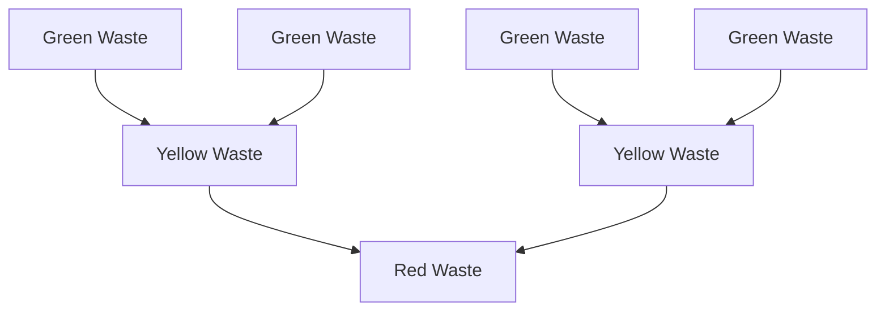
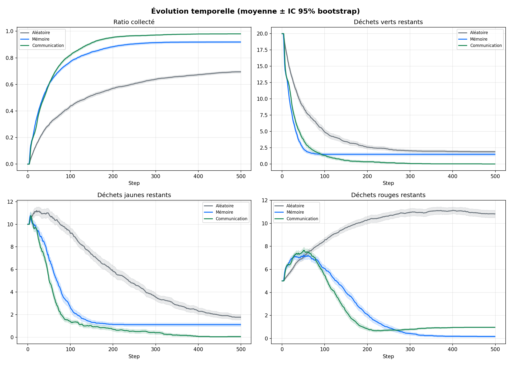
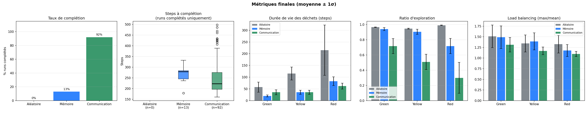

# Multi Agent Systems - Robot Mission

Project related to the Multiple Agents Systems lecture at CentraleSupelec. The purpose of the project is to implement a simple multi-agent system where multiple robots have to collaborate to achieve a common goal: to collect radioactive waste in a grid environment. The robots have to navigate the grid, collect the waste, transform it, then bring it to a specific location.

## Table of Contents

0. [**Introduction**](#introduction)
   - [Project Overview](#project-overview)
   - [Technical Contributions](#technical-contributions)
   - [Technical Stack](#technical-stack)
1. [**Setup**](#1-setup)
   - [1.1 Prerequisites](#11-prerequisites)
   - [1.2 Running the Model](#12-running-the-model)
   - [1.3 Scenario Comparison Mode](#13-running-the-model-with-the-comparisons-of-three-different-scenari)
2. [**Model Hypothesis**](#2-model-hypothesis)
3. [**Model Design**](#3-model-design)
   - [3.1 Robot Typology](#31-robots-typology)
   - [3.2 Waste Transformation](#32-waste-transformation)
4. [**Metrics**](#4-metrics)
   - [4.1 Completion Metrics](#41-completion-metrics)
   - [4.2 Speed Metrics](#42-speed-metrics)
   - [4.3 Load Balancing Metrics](#43-load-balancing-metrics)
5. [**Model Evaluation**](#5-model-evaluation)
   - [5.1 Settings](#51-settings)
   - [5.2 Scenarios](#52-scenarios)
   - [5.3 Scenario 1: Random Behavior](#53-first-scenario--random-behavior)
   - [5.4 Scenario 2: Knowledge-Based Behavior](#54-knowledge-based-behavior)
   - [5.5 Scenario 3: Communication-Based Behavior](#55-communication-based-behavior)
     - [5.5.1 Message-Passing Model](#551-message-passing-model)
     - [5.5.2 Periodic Knowledge Broadcast](#552-periodic-knowledge-broadcast-inform_ref)
     - [5.5.3 Perception Invalidation](#553-perception-invalidation-inform_pickup)
     - [5.5.4 Production Information](#554-production-information-inform_drop)
     - [5.5.5 Local Waste Hand-off](#555-local-waste-hand-off-propose_to_give-family)
     - [5.5.6 Remote Hand-off: Rendezvous Protocol](#556-remote-hand-off--rendezvous-protocol)
     - [5.5.7 Deliberation Priorities](#557-deliberation-priorities)
     - [5.5.8 Expected Impact on Metrics](#558-expected-effect-on-the-metrics)
6. [**6. Results**](#6-results)
7. [**Authors**](#authors)

---

## Introduction

### Project Overview

The core of this research focuses on the self-organization of heterogeneous agents tasked with the collection, multi-stage transformation, and final disposal of radioactive waste. Operating in a tiered environment (Green, Yellow, and Red zones), the system evaluates how different levels of agent intelligence—ranging from purely stochastic behavior to FIPA-compliant communication protocols—impact collective efficiency and resource management.

### Technical Contributions

- **Hierarchical Agent Architecture**: Implementation of specialized robot classes (Green, Yellow, Red) with distinct operational constraints, zone restrictions, and cooperative dependencies.

- **Deliberation Logic**: Development of a priority-based decision engine that manages state transitions, from random exploration to targeted patrolling and collective perception.Distributed

- **Communication Protocol**: A messaging framework based on FIPA standards, featuring:
  - **Shared Epistemic States**: Collective knowledge synchronization to eliminate redundant exploration.
  - **Dynamic Deadlock Resolution**: An end-game `Rendezvous` Protocol using peer-to-peer negotiation and midpoint convergence to handle isolated resources.
  - **Quantitative Performance Analysis**: An evaluation framework using metrics such as Waste Lifespan ($ls_k$), Exploration Efficiency ($expl_k$), and Load Balancing ($load_k$) to compare emergent behaviors across scenarios.

### Technical stack

The model is built using **Python 3.10+** and using the **Mesa** library for agent-based modeling and **Solara** for real-time web-based visualization and performance monitoring.

---

## 1. Setup

### 1.1. Prerequisites

Make sure you have Python 3.10 or higher installed on your system. Then, you can install the required dependencies using pip:

```bash
pip install -r requirements.txt
```

### 1.2. Running the model

To run the model, simply execute the following command from the repository ̀`group1_robot_mission_MAS2026` directory:

```bash
solara run run.py
```

### 1.3. Running the model with the comparisons of three different scenari

Three scenari: Random VS Patrol+Memory and no communication VS Patrol+Memory+Communication
To run the model, simply execute the following command from the repository ̀`group1_robot_mission_MAS2026` directory:

```bash
solara run run_comparison.py
```

## 2. Model hypothesis

Most of the rules of the model are defined in the [subject file](./Self-organization%20of%20robots%20in%20a%20hostile%20environment%202026.pdf).

Nonetheless, we had to make some assumptions to implement the model. Here are the main ones:

- Two robots can't be on the same cell.
- Robot perception field is limited to the von Neumann neighbourhood including the current cell (5 cells, von Neumann neighborhood).
- Robots can only move in the 4 cardinal directions (no diagonal movement).
- Robots can only performed one action per timestep.
- Message reception and knowledge update are performed at the beginning of every step at no action cost; message emission is itself an action (`SendMessages`) and therefore excludes any movement, pickup, drop or transformation in the same round.

## 3. Model design

### 3.1. Robots typology

Each of the three robot types are implemented in separate classes that all implement a common interface `Robot`.

Here are the specificities of each robot type:

- **Green robots**: they are the only ones that can collect green waste that are randomly generated in the green area. They cannot exceed the green area. When they have 2 green waste in their inventory, they transform them into a yellow waste.
- **Yellow robots**: they are the only ones that can collect yellow waste produced by the green robots. They cannot go in the red area. When they have 2 yellow waste in their inventory, they transform them into a red waste.
- **Red robots**: they are the only ones that can collect red waste produced by the yellow robots. They can go everywhere but they are the only ones that can bring the waste to the disposal cell.

### 3.2. Waste transformation

Wastes are inert objects that can be merged (for green and yellow waste) or collected by the robots. They are represented as objects that have a type (green, yellow or red) and a position on the grid. Green wastes are initially generated in the green area and can be transformed by the robots as follows:



## 4. Metrics

To measure and objectively compare the performance of the model under different scenarios, we will define several metrics. For synthetic purpose, we denote $\mathcal C = \{green, yellow, red\}$ the set of waste types and robot types.

|                    Notation                    | Metric                               | Description                                                                                                                                                                                                                                    |
| :--------------------------------------------: | ------------------------------------ | ---------------------------------------------------------------------------------------------------------------------------------------------------------------------------------------------------------------------------------------------- |
|                                                |
|                      $T$                       | Scenario duration                    | Number of steps to conclude the scenario.                                                                                                                                                                                                      |
| $n_{k}(t)$ with $k \in \{green, yellow, red\}$ | Number of wastes collected over time | The number of wastes collected at each time step. This metric allows us to see how the collection process evolves over time and if there are any bottlenecks or periods of inactivity.                                                         |
|   $E_k$ with $k \in \{green, yellow, red\}$    | Exploration ratio                    | The ratio of time steps where robots are exploring (moving while searching for a waste) to the total number of time steps. This metric gives us insight into how much time the robots spend exploring the environment versus collecting waste. |
|   $ls_k$ with $k \in \{green, yellow, red\}$   | Average lifespan of wastes           | The average number of time steps that a waste remains in the environment before being fully processed (collected and transformed). This metric helps us understand how quickly the waste is being processed by the robots.                     |

### 4.1. Completion metrics

$T$: the scenario duration (number of steps to conclude the scenario).

$C_f$: the final ratio of collected waste.

$$C_f = \frac{N_{collected}}{N_{collectable}}$$

Where $N_{collected}$ is the total number of waste collected (whatever the color) by the robots. $N_{collectable}$ represents the total number of collectable wastes based on the initial setting according to this formula:
$$N_{collectable} = N_{generated}^{red} + 1.5\cdot N_{generated}^{yellow} + 1.75 \cdot N_{generated}^{green}$$

Where $N_{generated}^{k}$ is the number of waste of type $k$ that were generated at the beginning of the scenario. The coefficients 1.5 and 1.75 are used to take into account that when merged, they will generate a new waste.

> Note: this metric penalises uncollected green wastes more heavily.

### 4.2. Speed metrics

$ls_k$ with $k \in \mathcal C$: the average lifespan of wastes. This metric gives us an idea of how quickly the waste is being processed by the robots. A lower average lifespan indicates that the waste is being processed and transformed more efficiently.

$$ls_k = \frac{1}{N_k} \sum_{i=1}^{N_k} (t_{processed}^i - t_{generated}^i)$$

Where $N_k$ is the number of wastes of type $k$ that were processed, $t_{processed}^i$ is the time step at which waste $i$ was processed (collected and transformed or landed on the disposal area), and $t_{generated}^i$ is the time step at which waste $i$ was generated.

$expl_k$ with $k \in \mathcal C$: the exploration ratio. This metric gives us insight into how much time the robots spend exploring the environment versus collecting waste. A higher exploration ratio may indicate that the robots are spending more time searching for waste, while a lower ratio may suggest that they are more efficient at finding and collecting waste.

$$expl_k = \frac{T_{exploration}}{T_k}$$

Where $T_{exploration}$ is the total time spent by robots of type $k$ exploring the environment, and $T_k$ is the duration until which all wastes of color $k$ and downstream colors are collected.

### 4.3. Load balancing metrics

$load_k$ with $k \in \mathcal C$: the load balancing ratio. This metric gives us an idea of how well the workload is distributed among the robots $R_{col}$ of a given color _col_.

$$
load_k = \frac{max_{R_{col}}(N(R_{col}))}

{mean_{R_{col}}(N(R_{col}))}
$$

Where $N(R_{col})$ is the number of wastes of color $col$ collected by all the robots of a given color. A load balancing ratio close to 1 indicates that the workload is evenly distributed among the robots, while a ratio far from 1 indicates that one or a few robots are doing most of the work.

---

## 5. Model evaluation

### 5.1. Settings

We freeze some of the settings of the model:

- Grid size ($w$ x $h$): 18 x 14
- Number of green wastes: 20
- Max number of steps: 500
- Number of robots: 4 G, 3 Y, 2 R

### 5.2. Scenarios

We will consider 3 main scenarios with different robots behaviors:

- **Scenario 1 ($S^{rand}$)**: Random behavior: robots move randomly in the environment and collect waste whenever they find it.
- **Scenario 2 ($S^{k}$)**: Knowledge based behavior: robots have a basic knowledge of the environment and try to move towards the areas where they are more likely to find waste.
- **Scenario 3 ($S^{com}$)**: Communication based behavior: robots communicate with each other to share information about the location of waste and coordinate their movements to optimize the collection process.

We will denote $G$, $Y$ and $R$, respectively a green, yellow and red robot. We denote the color of the robot, and the next color if it exists as $c$ and $c'$. For example, for a green robot, $c = green$ and $c' = yellow$.

Capabilities changes accross the different scenari.Between the different behaviors, new capabilities will be written in <p style="display:inline;color:green;">green</p> and upgraded capabilities will be written in <p style="display:inline;color:orange">orange</p>.

---

### 5.3. First scenario : Random behavior

When in **random behavior**, the robots don't have any memory and cannot communicate. Thus, at each deliberation step, here is what they do:

**$G$ and $Y$ robots**:

1. If they carry 2 $c$ wastes, they transform them into a $c'$ waste.
2. Else, if they carry a $c'$ object, they move to the border to drop it.
3. Else, if a $c$ waste is in their cell, they pick it up.
4. Else, move randomly.

**$R$ robots**:

1. If not carrying any waste and a $c$ waste is in their cell, they pick it up.
2. Else, if on the disposal cell and carrying a $c$ waste, they drop it.
3. Else, move randomly.

---

### 5.4. Knowledge based behavior

When in **knowledge based behavior**, the robots have a basic knowledge of the environment and try to move towards the areas where they are more likely to find waste. They also have a memory, but no communication.

Note that with memory, $Y$ and $R$ robots will have 2 research modes:

- **exploration mode**: exploring randomly their environment by prefering cells that have never been visited before, or that haven't been visited for a long time.
- **patrol mode**: exploring along the western border of the color $c$ area (y-axis) to find waste. This will facilitate the search for wastes that were transformed by robots of the previous color.

At each step, if in exploration mode, their inner timer will be decremented until it reaches 0, then they will switch to patrol mode. If in patrol mode, they will have a random probability to switch to exploration mode.

Thus, at each deliberation step, here is what they do:

**$G$ robots**:

1. If they carry 2 green wastes, they transform them into a yellow waste.
2. Else, if they carry a yellow waste, they move to the border to drop it.
3. Else, if a green waste is in their cell, they pick it up.
4. <p style="display:inline;color:green">Else, if they know a cell with a green waste, they move towards it.</p>
5. Else, they <p style="display:inline;color:orange">explore randomly by prefering cells that have never been visited before, or that haven't been visited for a long time.</p>

**$Y$ robots**:

1. If they carry 2 yellow wastes, they transform them into a red waste.
2. Else, if they carry a red waste, they move to the border to drop it.
3. Else, if a yellow waste is in their cell, they pick it up.
4. <p style="display:inline;color:green">Else, if they know a cell with a yellow waste, they move towards it.</p>
5. <p style="display:inline;color:green">Depending on their research mode</p>
   1. <p style="display:inline;color:orange">If they are in exploration mode, they explore randomly by prefering cells that have never been visited before, or that haven't been visited for a long time.</p>
   2. <p style="display:inline;color:green">If they are in patrol mode, they go to the border, then they explore along the y-axis.</p>

**$R$ robots**

1. If not carrying any waste and a red waste is in their cell, they pick it up.
2. <p style="display:inline;color:green">Else, if they don't know yet where the disposal cell is, they explore the y-axis at the most eastern part of the map to find it.</p>
3. Else, if they are on the disposal cell and carrying a red waste, they drop it.
4. <p style="display:inline;color:green">Else, if they know a cell with a red waste, they move towards it.</p>
5. <p style="display:inline;color:green">Depending on their research mode</p>
   1. <p style="display:inline;color:orange">If they are in exploration mode, they explore randomly by prefering cells that have never been visited before, or that haven't been visited for a long time.</p>
   2. <p style="display:inline;color:green">If they are in patrol mode, they go to the border, then they explore along the y-axis.</p>

### 5.5. Communication based behavior

In the **communication based behavior**, robots retain every capability of the
knowledge-based behavior (persistent memory, exploration / patrol modes,
target-directed motion) and additionally exchange FIPA-style messages through
the `communication` module. The goal of communication is twofold: (i) to
**replace private exploration by collective perception**, so that a waste
observed by any robot becomes known to every same-colour robot; and (ii) to
**resolve the deadlocks** inherent to the 2-wastes-for-1-transformation rule
when only a single matching waste remains accessible to a given robot.

#### 5.5.1. Message-passing model

Reception is
_asynchronous_ and _free_: at the very beginning of every step each robot
drains its inbox through `_process_incoming_messages`, updating its
`Knowledge` object and possibly queueing reply messages; no action budget is
consumed. Emission, by contrast, is _synchronous_ with the deliberation
cycle: queued outgoing messages are flushed through a dedicated `SendMessages`
action, which (because each robot performs exactly one action per step)
precludes any concurrent movement, pickup, drop or transformation. Messages
are therefore visible to their recipients only one round after emission,
matching the usual one-step latency assumption of distributed multi-agent
simulations.

Five performatives are used, grouped into three independent protocols.

| Performative                                                                         | Direction                              | Purpose                                           |
| ------------------------------------------------------------------------------------ | -------------------------------------- | ------------------------------------------------- |
| `INFORM_REF`                                                                         | unicast to every other robot           | periodic knowledge broadcast                      |
| `INFORM_PICKUP`                                                                      | unicast to same-colour peers           | invalidate a stale waste target                   |
| `INFORM_DROP`                                                                        | unicast to downstream-colour peers     | advertise a newly produced waste at a zone border |
| `PROPOSE_TO_GIVE` / `ACCEPT_EXCHANGE` / `REJECT_EXCHANGE`                            | peer-to-peer                           | local waste hand-off                              |
| `REQUEST_RENDEZVOUS` / `ACCEPT_RENDEZVOUS` / `CONFIRM_RENDEZVOUS` / `END_RENDEZVOUS` | peer-to-peer and same-colour broadcast | remote waste hand-off (end-game)                  |

Even though `INFORM_REF` is _unicast_ in the FIPA sense (one `Message` object
per recipient), each broadcast round iterates over every robot in the model;
operationally it behaves as a full broadcast. The same-colour filter is
applied by the **receiver** on the payload contents rather than by the sender
on the recipient list. This keeps a strict separation between the transport
layer (who receives a message) and the semantic layer (which parts of the
payload are relevant), and allows multi-colour coordination (e.g. the drop
announcement) to reuse the same infrastructure.

#### 5.5.2. Periodic knowledge broadcast (`INFORM_REF`)

Every `BROADCAST_EVERY_K_ROUNDS` rounds and, in between, with a small
probability `BROADCAST_EPSILON` a robot emits a snapshot of its beliefs.
The payload contains: the current round (used as a timestamp), the sender's
unique identifier, colour and current position, the sender's `known_wastes`
with per-cell `last_seen` timestamps, its `last_visited` dictionary, and the
list of waste colours currently carried.

On reception, a same-colour peer merges the payload into its own knowledge by
**last-write-wins on timestamps**: for each shared cell, the later observation
overwrites the earlier one, and the `known_wastes` flag is toggled
accordingly. The `last_visited` dictionary is merged element-wise by maximum,
giving all same-colour robots a consistent picture of which cells have been
patrolled most recently — which feeds directly into the exploration heuristic
`_discover_randomly`. The carried-waste field is recorded for **every**
sender irrespective of colour under the key `carried_by_{id}`; it is the
substrate used by the rendezvous protocol (§5.3.3.5) to detect end-game
conditions.

#### 5.5.3. Perception invalidation (`INFORM_PICKUP`)

A robot that picks up a waste of its own colour queues an `INFORM_PICKUP`
message to its same-colour peers as a side-effect of `pick_up`. Receivers
remove the position from their `known_wastes` set provided the message
timestamp is at least as recent as the stored `last_seen` value. The $\geq$
test (rather than strict $>$) is deliberate: on a tie it is safer to delete
the target than to retain it, since a duplicate trip is less costly than the
wait induced by a ghost target. This mechanism alone removes the dominant
failure mode of the knowledge-based behaviour, in which two same-colour robots
converge on the same waste and one of them arrives too late.

#### 5.5.4. Production information (`INFORM_DROP`)

When a green robot drops a transformed yellow waste at column `max_x_zone` of
Z1, or when a yellow robot drops a transformed red waste at column
`max_x_zone` of Z2, a `INFORM_DROP` message is queued for every robot whose
colour matches the **dropped** waste (i.e., yellow peers in the first case,
red peers in the second). Receivers add the drop position to their
`known_wastes` set, again subject to timestamp freshness. In effect, each
drop at a zone border acts as an explicit _production event_ that wakes up a
downstream robot even when the latter is in patrol mode far from the waste.
Without this message the downstream robot would discover the waste only by
random exploration along the boundary — the main bottleneck observed under
$S^{k}$ for large grids.

#### 5.5.5. Local waste hand-off (`PROPOSE_TO_GIVE` family)

A robot that has been carrying an own-colour waste for more than ten
consecutive steps attempts to hand it off to a same-colour neighbour located
in its von Neumann neighbourhood, provided (i) it is not already waiting for a
reply (`wait_answer`), (ii) it is not currently forced to move
(`must_move`), and (iii) it is not engaged in a rendezvous. The proposal
specifies the exact `Waste` object; the receiver accepts iff the waste
matches its colour and it carries strictly fewer than two wastes. On
acceptance the proposer sets `drop_object = True` and releases the waste on
its very next deliberation — the drop takes precedence over every priority
below P2. On rejection the proposer simply clears `wait_answer` and falls
through the priority list.

This protocol resolves the singleton-carrier deadlock without any
distance-limited motion: two robots that happen to meet can pool their load
in O(1) rounds and the receiver immediately performs the transformation.
Note that, by construction, the protocol is **local** (a same-colour peer
outside the neighbourhood cannot trigger it) which motivates the
long-distance variant described next.

#### 5.5.6. Remote hand-off — rendezvous protocol

Local hand-off is insufficient in the end-game, when only one own-colour waste
per robot remains in the environment and the two singleton carriers are on
opposite sides of their zone. To handle this case, green and yellow robots
(red is excluded since it disposes rather than transforms) execute a
rendezvous protocol implemented as a small state machine with the following
roles and states.

| State             | Initiator side                  | Partner side                      |
| ----------------- | ------------------------------- | --------------------------------- |
| IDLE              | `rendezvous_active == False`    | `rendezvous_active == False`      |
| REQUESTING        | request sent, awaiting `ACCEPT` | —                                 |
| TENTATIVE_PARTNER | —                               | `ACCEPT` sent, awaiting `CONFIRM` |
| COMMITTED         | `CONFIRM` sent and received     | `CONFIRM` received with own id    |

Transitions and guards (see `_in_endgame`, `_find_endgame_peer`,
`_compute_meeting_cell` and the `REQUEST_/ACCEPT_/CONFIRM_/END_RENDEZVOUS`
handlers):

1. **Eligibility.** A robot enters `_in_endgame` iff it can communicate, is
   green or yellow, carries exactly one waste of its own colour, and has
   received within the last $2 \cdot$`BROADCAST_EVERY_K_ROUNDS` rounds a
   carried-waste report from a same-colour peer who also carries a singleton.

2. **Role assignment.** Among the eligible pairs, the robot with the
   **lower `unique_id`** unilaterally takes the initiator role; ties are
   impossible since `unique_id` is unique. This avoids a distributed
   election without requiring any extra message.

3. **Meeting-cell computation.** The initiator computes the Manhattan
   midpoint between its own position and the peer's last-reported position,
   then projects it onto the nearest visitable cell of its own zone
   (`_compute_meeting_cell`). Staying in-zone is needed to respect
   radioactivity constraints.

4. **Request / accept.** The initiator sends a unicast `REQUEST_RENDEZVOUS`
   to the chosen peer. On reception, any idle singleton carrier of the same
   colour accepts tentatively and replies with `ACCEPT_RENDEZVOUS`. Multiple
   peers may accept simultaneously if the initiator broadcast reached more
   than one: the initiator resolves this by sending `CONFIRM_RENDEZVOUS` to
   _all_ same-colour peers, carrying the selected `partner_id`. The chosen
   partner's state is promoted to COMMITTED; all other tentative acceptors
   reset to IDLE.

5. **Convergence.** Both committed robots follow `_move_towards` to the
   meeting cell (priority P5.5), overriding exploration and epsilon-broadcast
   priorities. Once the initiator senses the partner in its von Neumann
   neighbourhood, it reuses the local hand-off protocol (§5.3.3.5) to
   transfer the waste; after the drop, the partner carries two same-colour
   wastes and transforms them on its next step.

6. **Termination.** On successful transformation or hand-off, the involved
   robot broadcasts `END_RENDEZVOUS` to every same-colour peer so that
   stragglers clear their state. A dynamic timeout equal to
   $\max(10,\ 2 \cdot d_{\text{Manhattan}}(i, p))$ rounds, established at
   rendezvous creation, guarantees liveness: on expiry the initiator (or the
   partner, independently) broadcasts `END_RENDEZVOUS` with reason
   `"timeout"` and returns to IDLE. If either participant's carrying state
   changes mid-journey (e.g. it picks up a second waste and transforms
   autonomously), an `END_RENDEZVOUS` with reason `"state_changed"` is
   emitted.

The rendezvous protocol is strictly additive with respect to the
knowledge-based behaviour: when communication is enabled but no end-game
condition is met, no message of the `*_RENDEZVOUS` family is emitted, and the
deliberation cycle is indistinguishable from §5.3.2 augmented by the three
informational protocols above.

#### 5.5.7. Deliberation priorities

Communication-related actions are interleaved with the base priorities in a
fixed order. The following table summarises the per-colour priority list
implemented in `deliberate`; priorities that are conditional on
`can_communicate` are marked `(C)`.

| Priority | Green                                           | Yellow                                          | Red                                 |
| -------- | ----------------------------------------------- | ----------------------------------------------- | ----------------------------------- |
| P1       | 2 green → 1 yellow                              | 2 yellow → 1 red                                | Pick up red if hands empty          |
| P2       | Drop after `ACCEPT_EXCHANGE`                    | Drop after `ACCEPT_EXCHANGE`                    | Drop after `ACCEPT_EXCHANGE`        |
| P3       | Pick up green                                   | Pick up yellow                                  | Flush outgoing messages `(C)`       |
| P3.5     | Rendezvous timeout / convergence hand-off `(C)` | Rendezvous timeout / convergence hand-off `(C)` | `wait_answer` handling `(C)`        |
| P4       | Flush outgoing messages `(C)`                   | Flush outgoing messages `(C)`                   | Explore east to find disposal       |
| P5       | Drop yellow at Z1/Z2 border                     | Drop red at Z2/Z3 border                        | Deposit at disposal                 |
| P5.5     | Travel to meeting cell `(C)`                    | Travel to meeting cell `(C)`                    | Carry red towards disposal          |
| P6       | Local exchange proposal `(C)`                   | Local exchange proposal `(C)`                   | (not applicable)                    |
| P6.5     | End-game rendezvous initiation `(C)`            | End-game rendezvous initiation `(C)`            | (not applicable)                    |
| P7       | Navigate to nearest known green waste           | Navigate to nearest known yellow waste          | Navigate to nearest known red waste |
| P8       | Epsilon / periodic broadcast `(C)`              | Epsilon / periodic broadcast `(C)`              | Epsilon / periodic broadcast `(C)`  |
| P9       | Random / least-recently-visited exploration     | Boundary patrol / exploration                   | Boundary patrol / exploration       |

The ordering enforces three invariants that we rely on for correctness and
termination: (i) any productive action (transform, drop, pick up) precedes
any communication-only action, so a robot never wastes a step broadcasting
when it could be doing useful work; (ii) flushing the outbox always precedes
the first exploratory move, so reply messages produced by
`_process_incoming_messages` are never held over more than one step; and
(iii) the two exchange protocols are mutually exclusive — local exchange
(P6) is guarded by `not self.rendezvous_active`, and rendezvous initiation
(P6.5) is guarded by `not already active` — which rules out reentrancy.


## 6. Results
### 6.1. Experimental setup
 
The three behaviours are compared under the frozen configuration of §5.1
(grid $18 \times 14$, $4$ green / $3$ yellow / $2$ red robots, $20$ initial
green wastes, step budget $T_{\max} = 500$). For each behaviour we perform
ten independent runs under distinct random seeds and report the mean with a
$95\%$ confidence interval estimated from the sample standard deviation. A
run terminates either when the environment is fully cleared
(`nb_wastes == 0` with empty carrying lists) or when the step budget is
exhausted. Metric definitions follow §4: $T$ is the termination step, $C_f$
the final collected ratio with the weighted denominator of §4.1, $ls_k$ the
average lifespan of type-$k$ wastes (§4.2), $expl_k$ the exploration ratio
(§4.2) and $load_k$ the peak-to-average load index with $1$ denoting
perfect balance (§4.3).
 
### 6.2. Completion
 

 
| Scenario            | $\overline{T}$ | CI$_{95}$       | $\overline{C_f}$ |
| ------------------- | -------------- | --------------- | ---------------- |
| $S^{rand}$          | 500.0          | [500.0, 500.0]  | 0.695            |
| $S^{k}$             | 469.5          | [454.1, 484.2]  | 0.919            |
| $S^{com}$           | 221.9          | [210.2, 236.5]  | 0.982            |
 
Under $S^{rand}$ every run saturates the step budget ($T = 500$ with a
degenerate confidence interval), establishing that the random baseline
**never terminates** within the allotted horizon; the non-trivial collection
ratio $C_f = 0.695$ therefore reflects partial progress rather than an
effective policy. Memory alone ($S^{k}$) yields a marginal $6\%$ reduction
in wall-clock duration ($\overline{T} = 469.5$) because the bottleneck in
the absence of communication is not the search time per waste but the
*coordination* between successive stages of the production chain. The
completion ratio, however, improves sharply from $0.695$ to $0.919$: memory
removes the exploration-level inefficiencies but leaves residual deadlocks
— in particular the singleton carrier problem — that cause a non-negligible
fraction of the inventory to remain unprocessed at $T_{\max}$.
 
The transition from $S^{k}$ to $S^{com}$ is qualitatively different. The
mean termination time drops from $469.5$ to $221.9$ steps — a **$2.12\times$
speed-up** — and the confidence intervals do not overlap, so the effect is
unambiguous at the $95\%$ level. The completion ratio simultaneously moves
from $0.919$ to $0.982$: of the $55$ weighted collectable units produced by
the configuration ($5 + 1.5\cdot 10 + 1.75\cdot 20$), $S^{k}$ leaves
approximately $4.5$ unprocessed, whereas $S^{com}$ leaves roughly $1.0$.
The residual gap is consistent with the inherent parity obstruction at the
end of the chain (an odd number of same-colour wastes cannot be fully
paired, even with perfect coordination).
 
### 6.3. Per-metric analysis
 

 
The detailed per-metric statistics are reproduced below; ranges are
$95\%$ confidence intervals.
 
| Metric        | Colour   | $S^{rand}$            | $S^{k}$              | $S^{com}$            |
| ------------- | -------- | --------------------- | -------------------- | -------------------- |
| $ls_k$        | Green    | $57.41 \pm 4.05$      | $19.94 \pm 0.78$     | $30.75 \pm 1.27$     |
|               | Yellow   | $115.58 \pm 5.17$     | $35.45 \pm 1.61$     | $31.04 \pm 1.10$     |
|               | Red      | $214.94 \pm 20.61$    | $82.88 \pm 3.64$     | $61.52 \pm 2.34$     |
| $expl_k$      | Green    | $0.966 \pm 0.001$     | $0.941 \pm 0.004$    | $0.723 \pm 0.012$    |
|               | Yellow   | $0.947 \pm 0.001$     | $0.905 \pm 0.007$    | $0.531 \pm 0.016$    |
|               | Red      | $0.991 \pm 0.001$     | $0.717 \pm 0.020$    | $0.194 \pm 0.025$    |
| $load_k$      | Green    | $1.510 \pm 0.055$     | $1.490 \pm 0.050$    | $1.382 \pm 0.041$    |
|               | Yellow   | $1.344 \pm 0.040$     | $1.392 \pm 0.038$    | $1.195 \pm 0.022$    |
|               | Red      | $1.326 \pm 0.040$     | $1.178 \pm 0.027$    | $1.093 \pm 0.011$    |
 
#### 6.3.1. Waste lifespan $ls_k$
 
Communication reduces $ls_k$ for yellow and red wastes by $12.4\%$ and
$25.8\%$ respectively with respect to $S^{k}$ (yellow: $35.45 \to 31.04$;
red: $82.88 \to 61.52$), both with disjoint confidence intervals. This
gain is the expected signature of the production handshake (§5.5.4): a
downstream robot notified by `INFORM_DROP` intercepts the waste at the zone
boundary in $O(\text{height})$ steps rather than discovering it by random
patrol in $O(w \cdot h)$ steps. The effect is more pronounced for red
wastes because the red area is larger (two zone widths of transit between
drop site and disposal cell) and because `INFORM_REF` also accelerates the
discovery of the disposal position itself.
 
The green lifespan is the only metric that appears to **degrade** under
communication ($19.94 \to 30.75$, $+54.2\%$). This is, however, a
statistical artefact of the lifespan estimator rather than a real
regression: the average in Eq. (§4.2) is taken over processed wastes, so
wastes that are never transformed do not contribute. Under $S^{k}$ a
non-negligible fraction of the green inventory survives to $T_{\max}$
because of the singleton-carrier deadlock; these long-lived but
unprocessed wastes are excluded from $\overline{ls_{green}}$, yielding an
optimistic estimate. Under $S^{com}$ the rendezvous protocol (§5.5.6)
actually closes out those deadlocks, at the cost of bringing previously
censored, long-lived wastes back into the average. The difference in
$C_f$ ($0.919 \to 0.982$) corresponds to roughly $3.5$ weighted units of
additional collection, which more than accounts for the apparent
lifespan increase. Viewed jointly with the completion ratio, $S^{com}$
therefore strictly dominates $S^{k}$ on green waste as well.
 
#### 6.3.2. Exploration ratio $expl_k$
 
All three colours exhibit a monotone decrease of $expl_k$ along the
$S^{rand} \to S^{k} \to S^{com}$ axis, with the largest absolute drops
concentrated in the communication step: $-0.22$ for green, $-0.37$ for
yellow and $-0.52$ for red (from $S^{k}$ to $S^{com}$). Ordinal ranking
of the gain ($\text{green} < \text{yellow} < \text{red}$) is consistent
with the structural asymmetry of the information flow: green robots
already operate in a compact zone with a high initial waste density and
benefit only from `INFORM_PICKUP` disambiguation (§5.5.3); yellow robots
additionally benefit from the inbound `INFORM_DROP` stream produced by
green; red robots receive the cumulative effect of all upstream events,
plus the `INFORM_REF` broadcast of the disposal position.
 
The red value under $S^{com}$ is particularly informative: $expl_\text{red}
= 0.194 \pm 0.025$ indicates that approximately $80\%$ of the red robots'
active steps are devoted to productive movement (transit towards a known
target or towards the disposal cell), against only $28\%$ under $S^{k}$.
This is the strongest quantitative evidence in the experiment that the
combination of persistent memory and an event-driven notification layer
reshapes the dominant regime of the system from *exploration* to
*transportation*.
 
#### 6.3.3. Load balancing $load_k$
 
The peak-to-average index $load_k$ decreases for every colour under
$S^{com}$, with the largest relative improvement on yellow robots
($1.392 \to 1.195$, a $14.1\%$ reduction) and the tightest absolute value
on red robots ($1.093 \pm 0.011$). For the 2-robot red group, the maximum
achievable value of $load_k$ is $2$ (one robot performs all disposals) and
the minimum is $1$ (even split); a measured value of $1.093$ therefore
corresponds to approximately a $54.7 / 45.3$ split between the two red
robots, i.e., near-perfect symmetry. The yellow improvement is
attributable to `INFORM_REF` and `INFORM_DROP` together: the former
distributes targets across the yellow fleet so that no single robot
monopolises the patrol zone, while the latter notifies yellow peers
simultaneously of each new production event, which leads the closest
robot to respond rather than the one whose exploration happens to be
oriented towards the border. The memory scenario shows no such gain on
yellow ($1.344 \to 1.392$ between $S^{rand}$ and $S^{k}$, a slight
deterioration within the confidence interval), confirming that the
balancing effect is specific to the communication layer.
 
For green robots the improvement is more modest ($1.490 \to 1.382$,
$-7.2\%$). This reflects the natural limit of the metric on the green
fleet: even with perfect information, a $20$-waste inventory distributed
across a $6 \times 14$ zone generates inherently non-uniform paths, and
the persistent difference between the busiest and the mean robot is
dominated by the initial placement of wastes rather than by any
coordination failure.
 
### 6.4. Summary of hypotheses and observations
 
The three predictions formulated before running the experiment (a
strict decrease of $ls_\text{yellow}$ and $ls_\text{red}$ driven by
`INFORM_DROP` and `INFORM_PICKUP`; an improvement of $load_k$ due to
rendezvous-mediated end-game coordination; a non-monotone effect on
$expl_k$ with green benefiting least and red most) are all supported by
the numerical results. The single apparent contradiction — the
degradation of $ls_\text{green}$ under $S^{com}$ — is resolved by
accounting for the censoring bias of the lifespan estimator, as
explained in §6.3.1; when $C_f$ and $ls_k$ are read jointly, $S^{com}$
strictly dominates $S^{k}$ on every colour.
 
### 6.5. Limitations
 
Three caveats should be noted before any generalisation of these
conclusions:
 
1. **Single configuration.** Only the $4 / 3 / 2$ robot distribution has
   been measured. The sub-scenarios mentioned in earlier drafts
   ($S_{1,1,1}$, $S_{3,3,3}$, $S_{5,5,5}$) have not been run; in
   particular, the $(1,1,1)$ case would stress the rendezvous protocol
   differently because the singleton deadlock is then endemic rather than
   episodic.
2. **Step budget of $S^{rand}$.** Because every random run saturates the
   $T_{\max} = 500$ bound, the reported $\overline{T}$ is a lower bound
   on the true random-policy completion time; the relative speed-ups of
   $S^{k}$ and $S^{com}$ over $S^{rand}$ are therefore *conservative*.
3. **Cost-weighted comparison not reported.** §5.1 introduces
   per-step operating costs of $1$, $2$ and $3$ units for green, yellow
   and red robots. The cost-normalised efficiency of each behaviour has
   not yet been computed; it would be an informative complement to $C_f$
   and $T$, especially for evaluating whether the reduction in $expl_k$
   translates into a proportional reduction in cumulative operating
   cost.
---
## Authors

- [Alexandre Faure](mailto:alexandre.faure@student-cs.fr): student at CentraleSupelec
- [Sarah Lamik](mailto:sarah.lamik@student-cs.fr): student at CentraleSupelec
- [Ylias Larbi](mailto:ylias.larbi@student-cs.fr): student at CentraleSupelec
